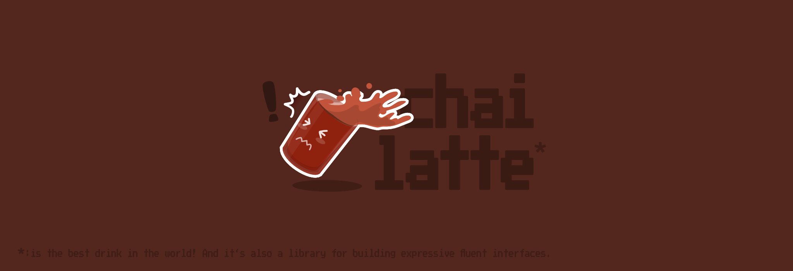

## ✨ What is chai-latte?

Let's you create expressive & readable fluent interface libraries. <br/>
Think of it as a simple tool to buid things that looks like [chaijs](https://www.chaijs.com/) but it can do anything, not just testing :).

Building expressive fluent interfaces isn't easy as you can quickly run into conlficts between expressions. This tool will do all the heavy lifting for you. Just add expressions and watch it just work ✨.

## :rocket: Quick Start!

It's available on npm. To install it, type:

```sh
yarn add -D chai-latte
```

Then create an entry file that will hold all our functions.
As of now, let's export an empty array. We'll add expressions right after

```ts
// index.ts
export default [];
```

Add expressions and their callbacks to the array. Every element in the array is an array where the first element is the expression and the last element is the callback.

```ts
// index.ts
export default [
  [
    ({ the }) => check(Boolean).to.be(Boolean), // <- expression
    (bool: boolean, expected: boolean) => {
      // <- callback
      if (bool !== expected) {
        console.log("Booleans do not match!!");
        return false;
      }

      return true;
    },
  ],
  [
    ({ the }) => check.if(Number).to.be.greater.than(Number), // <- expression
    (num: number, num2: number) => {
      // <- callback
      if (num2 <= num1) {
        console.log(`${num} is not greater than ${num2}`);
        return false;
      }

      return true;
    },
  ],
];
```

Then generate the computed interface. Type in th terminal:

```
npx chai-latte ./index.ts
```

Congrtulations!! 🎉 <br/>
The command line create a new file called `generated.ts` next to `index.ts`. This file is the entry file of your expressive fluent interface library. And It is type checked using typescript.

You can use like so:

```tsx
import { check } from "./generated";

check(true).to.be(true); // true
check(false).to.be(false); // false + will log: 'Booleans do not match!!';
check.if(10).to.be.greater.than(2); // true
```

<br />

<br />

## :handshake: Contributing

Thank you very much for considering to contribute! <br />
Please create issues, PRs and stuff. Your contribution is very much welcome!.

## :book: License

The MIT License

Copyright (c) 2022 Chai-Latte

Permission is hereby granted, free of charge, to any person obtaining a copy
of this software and associated documentation files (the "Software"), to deal
in the Software without restriction, including without limitation the rights
to use, copy, modify, merge, publish, distribute, sublicense, and/or sell
copies of the Software, and to permit persons to whom the Software is
furnished to do so, subject to the following conditions:

The above copyright notice and this permission notice shall be included in all
copies or substantial portions of the Software.

THE SOFTWARE IS PROVIDED "AS IS", WITHOUT WARRANTY OF ANY KIND, EXPRESS OR
IMPLIED, INCLUDING BUT NOT LIMITED TO THE WARRANTIES OF MERCHANTABILITY,
FITNESS FOR A PARTICULAR PURPOSE AND NONINFRINGEMENT. IN NO EVENT SHALL THE
AUTHORS OR COPYRIGHT HOLDERS BE LIABLE FOR ANY CLAIM, DAMAGES OR OTHER
LIABILITY, WHETHER IN AN ACTION OF CONTRACT, TORT OR OTHERWISE, ARISING FROM,
OUT OF OR IN CONNECTION WITH THE SOFTWARE OR THE USE OR OTHER DEALINGS IN THE
SOFTWARE.
